# Athletics Performance Analytics

*Refer to [README.md](https://github.com/SBU-Sports-Metrics/507_groupproject_2025/blob/main/README.md) for an overview about reproducing project*

## Table of Contents

1. [Description](#description)
2. [Overview of each part](#overview-of-each-part)
3. [Part 1: Data Connection and Exploration](#1-data-connection-and-exploration)
4. [Part 1 Key Findings](#part-1-key-findings)
5. [Research Question](#research-question)
6. [Metric Selection](#metric-selection)
7. [Part 2: Cleaning and Transformation](#2-data-cleaning-and-transformation)
8. [Part 3: Longitudinal Analysis and Visualization](#3-longitudinal-analysis-and-visualization)
9. [Streamlit App](#streamlit-app)
10. [Part 4: Research Synthesis and Application](#4-research-synthesis-and-application)
11. [Research & Data Gaps](#research-and-data-gaps)
12. [Operationalizing Thresholds](#operationalizing-thresholds) 
13. [Flag System](#flag-system)
14. [Recommendations](#recommendations)
15. [Practical Applications](#practical-applications-and-utility)
16. [Part 4 Key Insights](#part-4-key-insights)
17. [Closing Remarks](#closing-remarks)
18. [Limitations](#limitations)
19. [Was the research question answered?](#was-the-research-question-answered)
20. [Resources](#resources)
        (*Includes Tools & Team Members*)
21. [References](#references)

## Description

This data-science/informatics-based Exploratory Data Analytics (EDA) project explores a sanitized collegiate athletes sample dataset of student athletes of a US-based NCAA Tier-1 University. The aim is to go through the entire EDA and federated analytics processes, creating remote database connections, and various methods and techniques to extract practically usable insight from the data about the use of athlete sports testing using various metrics and devices. Python and its various tools are majorly used to access, explore, clean, transform and parse data from a remote dataset. Various statistical techniques were used to meaning and insights from the datasets. This exploration was based on a research question based on a thorough literature review.

The project has been successful in doing the following in sports performance area:
- Identifying and addressing gender equity gaps, especially the scarcity of sports research based on women players.
- Exploring the whole dataset based with the aid of a logical framework that bridges various metrics and devices with well researched logic and body-of-work.
- Standardizing thresholds across systems.
- Building a foundation for multi-metric performance metrics that build on the likes of fatigue detection models and others.
- Supporting consistent and reproducible athletic testing and monitoring in collegiate settings for both male and female athletes.  
^ Refer to `Part1_Framework.pdf` for details on framework.

[TOC](#table-of-contents)

---

## Overview of each part

**Part 1: Data Connection and Exploration**

This phase was about connecting to the database, checking data quality, exploring the available performance metrics, and choosing five metrics for detailed study. SQL and Python (SQLAlchemy and pandas) were used to assess whether the data was complete, which data-sources  (Hawkins, Kinexion, or Vald) were covered, how, time-span, athlete coverage, and metric identification. This phase aimed to lay a solid foundation for further analysis by identifying reliable, well-represented metrics based records. By focusing on well represented device- and team-focused metrics-based data, subsequent steps would be grounded in both representative and best possible data to get statistically sound insights to answer the research question. A **literature review** was conducted to get to the research question. This phase helped create a solid foundation to derive practically applicable insights from the data, identify gaps, and note data issues. Database table used for the project: `research_experiment_refactor_test`.  
^ Refer to `Part1_Summary.pdf` for details & `Part1_LitReview.pdf` for literature review

**Part 2: Data Cleaning and Transformation**

This phase was about wrangling the data to extract usable, meaningful and representative data ready for analysis. It involved cleaning, transforming, and fixing the raw data to ensure it is usable, consistent and representable. The output was structured as a dataset suitable for statistical testing and visualization. 

**Part 3: Longitudinal Analysis and visualization**

This phase was about doing statistical tests, analysis and getting insights about selected individual players as sample data, extrapolating the knowledge to the whole team(s), and gaining insights to answer the research question and find gaps. It also involved creating visualizations.

**Part 4: Research Synthesis and application**

This phase focused on building a flagging system that operationalized the analytical insights. The flagging system applied threshold logic and statistical criteria to identify athletes who may require attention based on their performance. Insights, recommendations and future work is addressed in this part.

[TOC](#table-of-contents)

---

## 1. Data Connection and Exploration
### 1.1 Setup and Connection
- Set up Python environment with required libraries (sqlalchemy, pandas, pymysql)
- Connected to a remote SQL database via a url string, and a connection engine using a secrets .env file. 
- Test connection by querying the research_experiment_refactor_test table
- Verified the secured schema access to explore the data types and data structure to identify metric availability across the three devices (Hawkins, Kinexion and Vald) used to measure sports performance.

### 1.2 Data Quality Assessment 
- 1.2.1 Unique athletes: `1287` 
- 1.2.2 Unique sports/teams: `92`
- 1.2.3 Available date ranges: `10-15-2018` to `10-21-2025`
- 1.2.4 Devices: Kinexion (most records) `4073754`, Hawkins `24922372`, Vald (least records) `51300`
- 1.2.5 Athletes with missing or invalid names: `0`
- 1.2.6 Athletes have data from multiple sources: `541`

[Terminal output]

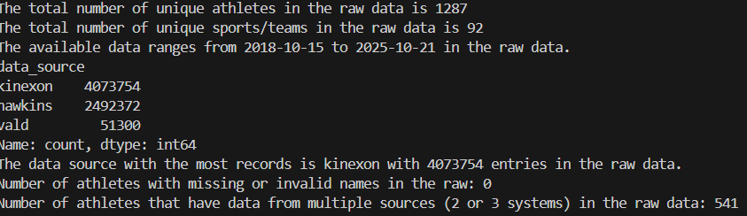

### 1.3 Metric discovery and selection

#### Understanding the 3 devices

- *Hawkins:* Jump + Force Plate Metrics: Jump Height, Peak Propulsive Power (PPP), Peak Velocity, Concentric/RSI derivatives.

- *Kinexion:* Tracking Metrics: Speed Max, Peak Velocity, Distance Total, accelerations, decelerations

- *Vald:* Strength & Asymmetry: unilateral force outputs, asymmetry calculations.

1.3.1 Top 10 most common metrics for Hawkins data

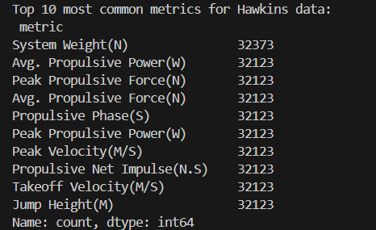

 

1.3.2 Top 10 most common metrics for Kinexion data

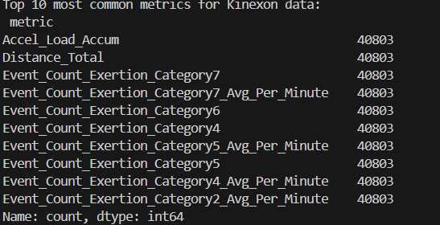

 

1.3.3 Top 10 most common metrics for Vald data

 

1.3.4 Unique metrics exist across all data sources: `548`

1.3.5 Date range and record count for the top metrics in each data-source (device)

All devices

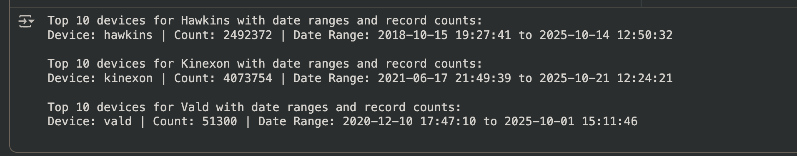

Hawkins

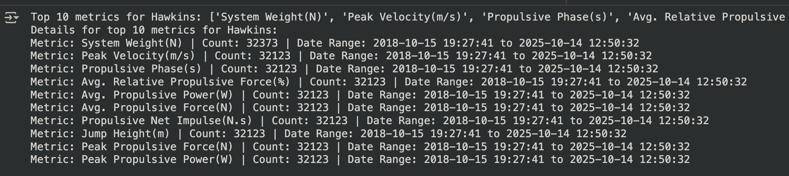

Kinexion

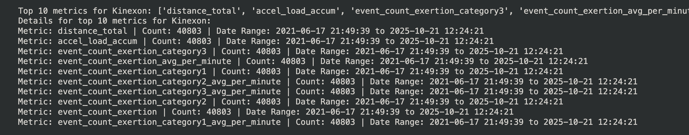

Vald

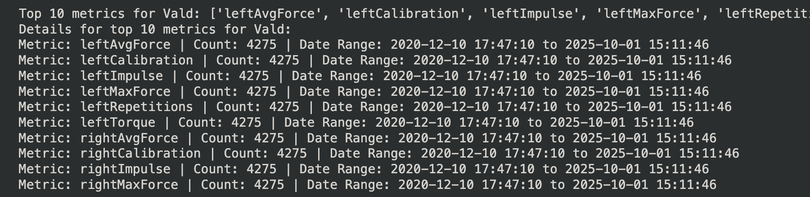

[TOC](#table-of-contents)

---

## Part 1 Key Findings

| Data Quality Question | Key Findings | 
|---|---|
|Unique athletes| Consistent across sources; overlapping IDs present |  
|Teams with most data| Football, Men’s Basketball, Women’s Basketball | 
|Date ranges| Varied by system; Vald had the broadest continuous timeline | 
|Largest data source |Kinexion had the highest record count| 
|Missing or invalid names | Significant issues detected; approximately one million unusable rows were flagged| 
|Multi-system athletes | Several athletes had data from 2–3 systems, useful for cross-metric triangulation| 

 

[TOC](#table-of-contents)

---

### 1.4 Brief review of literature and metric selection

Refer to:
- `Part1_Framework.pdf` for more on why RFD and ME&GC constructs formed the theoretical framework for this inquiry
- `Part1_LitReview.pdf` for literature review

## Research Question
> What are the most important metrics for Rate of Force Development (RFD) and Movement-Efficiency & Gait-Complexity (ME&GC), and how do female and male athletes perform in these metrics?

[TOC](#table-of-contents)

---

1.4.1 

## Metric Selection

### Understanding the metrics and sports coverage

An initial effort in metrics exploration is presented below. 

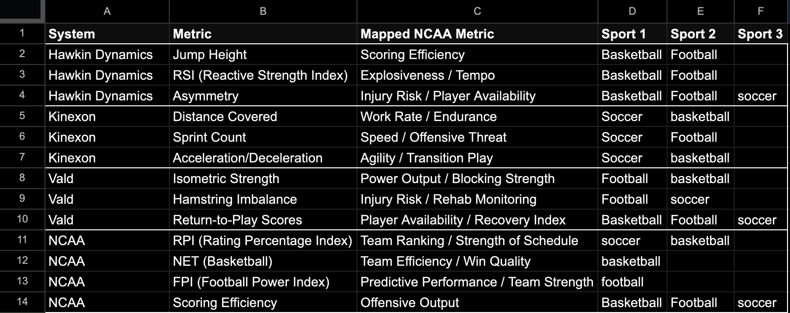

 

Across all metrics, five Hawkins and Kinexion metrics stood out for availability, quality, and cross-sport coverage.

- **Jump Height** *(in top 10 Hawkins metrics by count above in 1.3.5)*
- **Peak Propulsive Power** *(in top 10 Hawkins metrics by count above in 1.3.5)*
- **Peak Velocity** *(in top 10 Hawkins metrics by count above in 1.3.5)*
- **Speed Max** *(top Kinexion metric tested for Women's Basketball)*
- **Distance total** *(in top 10 Kinexion metrics by count above in 1.3.5)*

The 5 metrics were selected because of the properties of correlation and their predictive power when used in combination. 

| Metric              | Importance                              | Known Norms / Notes                            |
|----------------------|----------------------------------------|------------------------------------------------|
| Jump Height          | Neuromuscular readiness[^1]            | >10–15% declines = fatigue indicator[^2]|
| Peak Propulsive Power (PPP) | Explosive force production[^3]     | Sensitive to micro-fatigue[^4]|
| Peak Velocity        | Measures movement efficiency & output[^5]  | >10% asymmetry meaningful[^6]|
| Speed Max            | High-speed performance and positional analysis[^7] | <90% of best = underperformance[^8]|
| Distance Total       | Indicates cumulative load & ACWR spikes * [^9] | >20% ACWR associated with risk[^10]|

* ACWR: Acute Chronic Workload Ratio | References section is at the end

Some of the thresholds above changed later in Part 4 after digging deeper into the literature was needed to build the Flagging system

These 5 metrics were explored only for `Basketball` as both Women's Basketball and Men's Basketball teams had the most records for the selected metrics to conduct a gender-based study from the dataset.

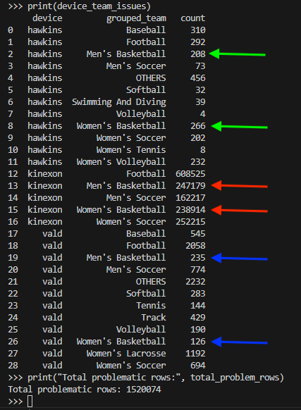

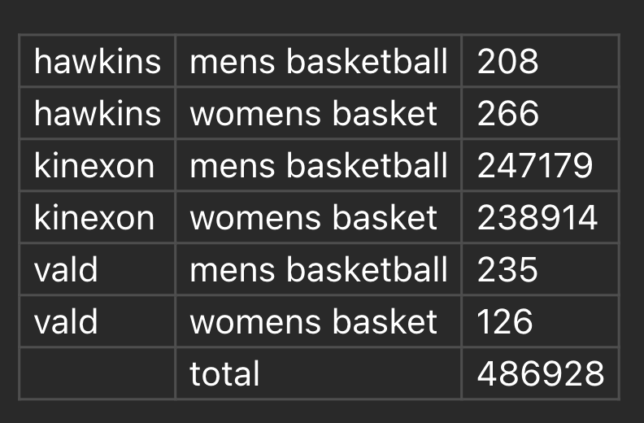

---
> **Note:** The small number of Hawkins records for both Basketball Women's and Mens teams and the large number of Kinexion records could possibly be there because Kinexion likely captures more holistic, continuous records due to its **wearable integration**, while Hawkins tests (force plates) focus on **fewer, lab-based reps**. Though this fact has not been validated, it seems the wearable nature of Kinexion based tests is the reason for the order of magnitude more test records for Kinexion, compared to Hawkins, for Basketball and 5 metrics selected for this EDA project.

---

1.4.2 

## Selected Metrics: Low/Normal/Peak Values

| Metric | Device | Group/Team | Low | Normal | Peak |
|---|---|---|---|---|---|
| Jump Height (m) | Hawkins | Men's Basketball | <0.30 | 0.30–0.70 | >0.70 |
| | | Women's Basketball | <0.21 | 0.21–0.45 | >0.45 |
| | | Football | <0.30 | 0.30–0.55 | >0.55 |
| Peak Propulsive Power (W) | Hawkins | Men's Basketball | <3500 | 3500–9000 | >9000 |
| | | Women's Basketball | <2500 | 2500–7000 | >7000 |
| | | Football | <3000 | 3000–9000 | >9000 |
| Peak Velocity (m/s) | Hawkins | Men's Basketball | <3.0 | 3.0–4.5 | >4.5 |
| | | Women's Basketball | <2.5 | 2.5–4.0 | >4.0 |
| | | Football | <3.0 | 3.0–4.5 | >4.5 |
| Speed Max (m/s) | Kinexion | Men's Basketball | <4.0 | 4.0–7.5 | >7.5 |
| | | Women's Basketball | <3.5 | 3.5–7.5 | >7.5 |
| | | Football | <5.0 | 5.0–8.5 | >8.5 |
| Distance Total (m) | Kinexion | Men's Basketball | <4000 | 4000–7000 | >7000 |
| | | Women's Basketball | <3500 | 3500–6000 | >6000 |
| | | Football | <8000 | 8000–11500 | >11500 |
___

Metric ranges 

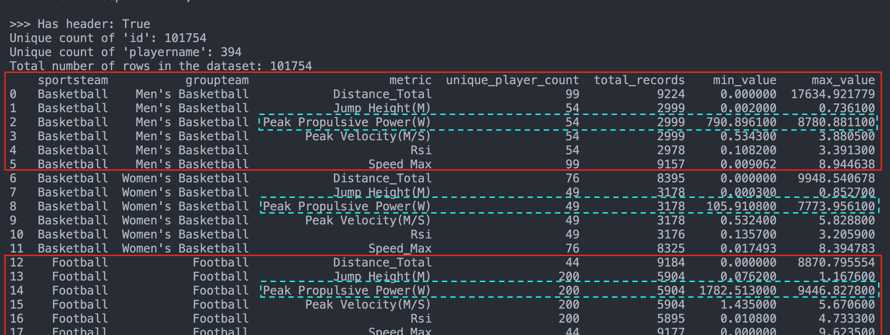

___

> **Note:** Football records show the contrast with not only women basketball players but also with women Baskteball players, indicating how different sports might be tracking different metrics and performance measures due to different performance expectations and Low/Normal/Peak ranges as is shown in `1.4.2` above. This was also confirmed later in `part3.2_viz_comparison.ipynb` with Box and Violin Plot Analysis for all sports with selected 5 metrics.
___

^ Refer to `Part1_Metrics.pdf` for additional work done to select the metrics.

[TOC](#table-of-contents)

---

## 2. Data Cleaning and Transformation

### 2.1 Missing data analysis

2.1.1 

### Selected metrics with the most NULL or zero values

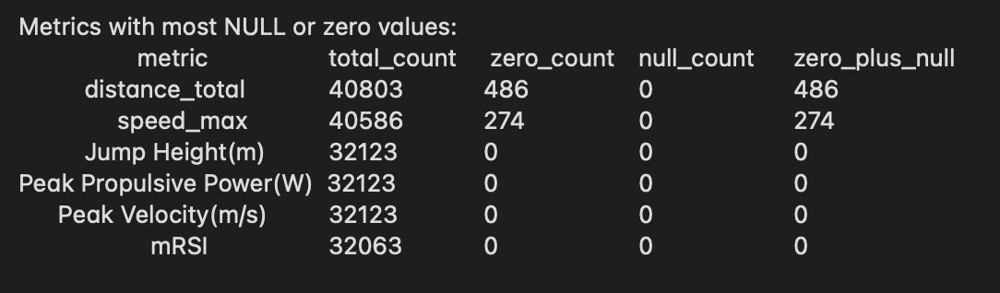

^ mRSI was later not used in the final analysis

2.1.2 

### % of athletes with > 5 measurements

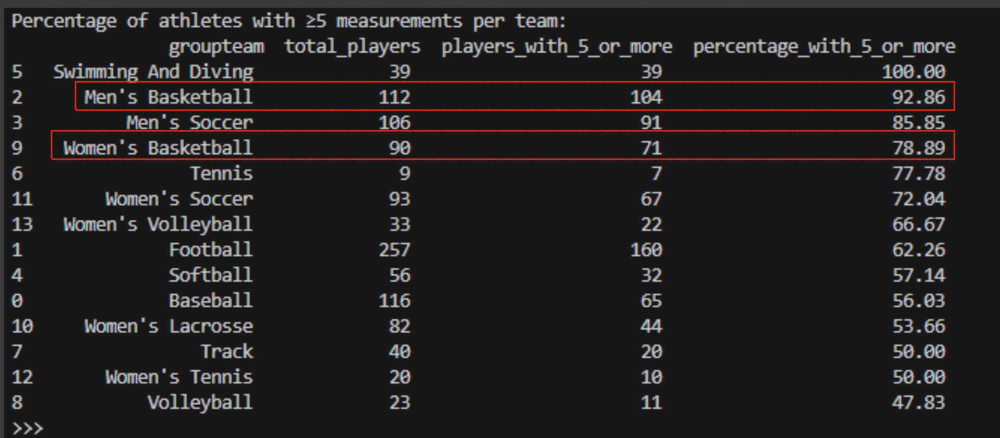=5 tests" width= "500">

 

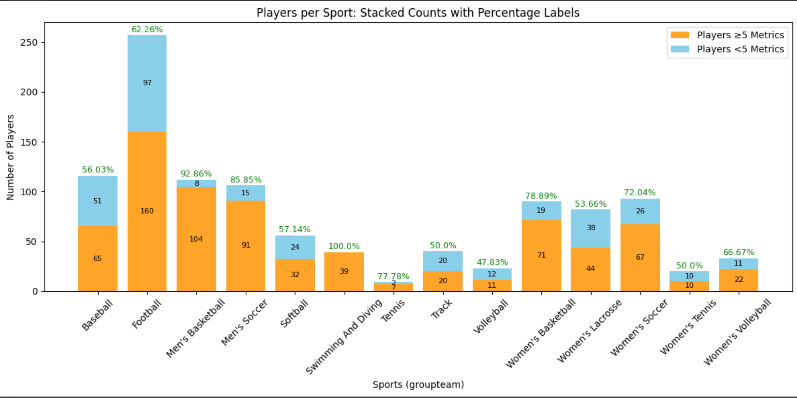=5 tests viz" width= "900">

---
> **Note:** The % of players with >5 tests is much more for Men's baskteball Team (~93%) than for Women's basketball team (~20% with less than 5 tests) in the sample dataset. Also seen is that testing in Football is overall much more thn in any other sport.
___

 

2.1.3 

### Count of players not tested in the last 6 months: `877`

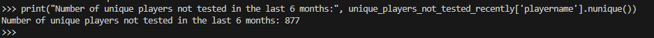

 

List of players not tested in the last 6 months

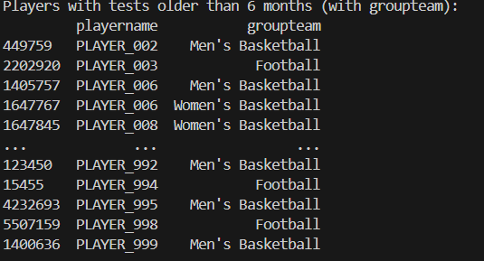

---
> **Note:** The code snapshot above is for total individual players, and can be easily be tweaked to show counts of players from specific teams who were tested in the last 6 months.  
___

2.1.4 

### Sufficient data to answer research question?

Not entirely, if the sample dataset is considered as a standalone data-source. 

However, when combined with the literature review findings, the sample dataset seems to be sufficient to observe wider representative trends that answer the research question: 
> *What are the most important metrics for Rate of Force Development (RFD) and Movement-Efficiency & Gait-Complexity (ME&GC), and how do female and male athletes perform in these metrics?*

When the data analysis from the dataset, regardless of data quality (sample size, record size, testing-frequency, testing-consistency, gaps, gender-based testing differences, and other extraneous factors like device availability for actual metric measurement), is combined with literature review findings, there is sufficient data to explore the following:
- were selected **constructs** well supported with scholarly work as the basis of the logical framework created to explore the research question?
- is there **correlation** between RFD and ME&GC constructs?
- were selected **metrics** well supported with scholarly work as the basis of this study?
- is there a strong **relationship** between the 5 selected metrics? 
- is there a considerable **gap** in gender-based testing and record keeping? 
- how do male and female athletes perform in the selected 5 metrics to answer the larger **research question**?
- are the selected 5 metrics sufficient to determine RFD and ME&GC based **sports performance observations and interventions**?

As these 7 questions can be adequately answered in this  data-project, it can be concluded that there was sufficient data to answer the research question, find gaps and make other observations/insights. Also see [Was the research question answered?](#was-the-research-question-answered) below

---

[TOC](#table-of-contents)

---

## 3. Longitudinal analysis and visualization

### 3.1 Individual Athlete Timeline

The following parts are included in `part3.1_viz_individual.ipynb`

3.1.1 Line plots 6-12 months: The time series line plots with markers may look a little crowded, but does the job for this project.  
^ Code is in ***3.1A** in part3.1_viz_individual.ipynb*.

Peak Propulsive Power

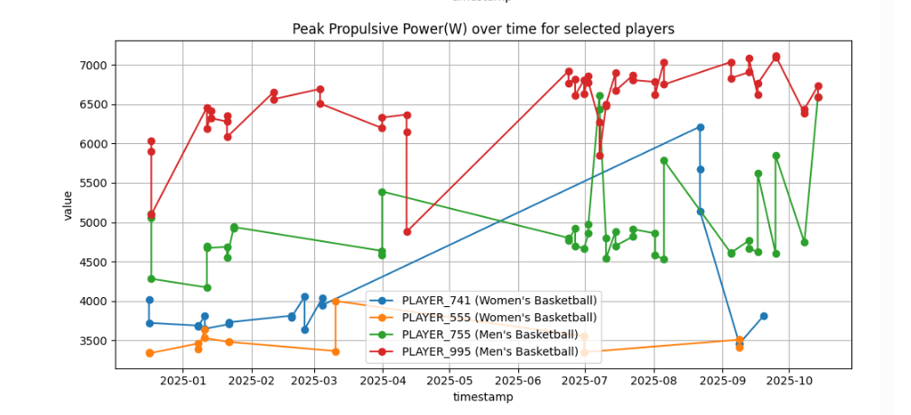

 

Jump Height

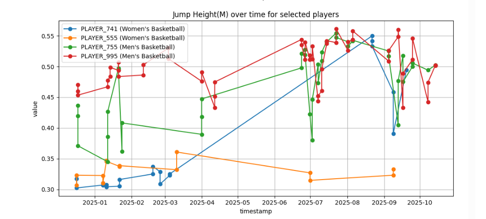

 

Peak Velocity

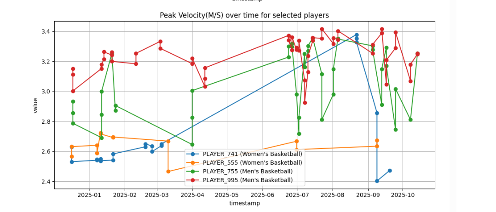

 

Speed Max

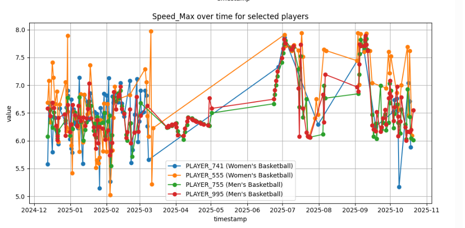

 

Distance Total

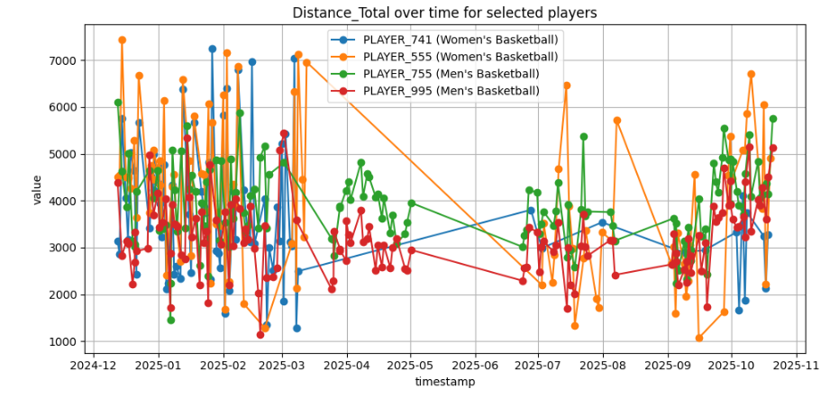

 

3.1.2 Best and worst performance dates: There are many reasons this data is not accurate as there are gaps and inconsistent testing.  
^ Code is in ***3.1B** in part3.1_viz_individual.ipynb*.

3.1.3 Trend (regression): Code is in ***3.1C** in part3.1_viz_individual.ipynb*.

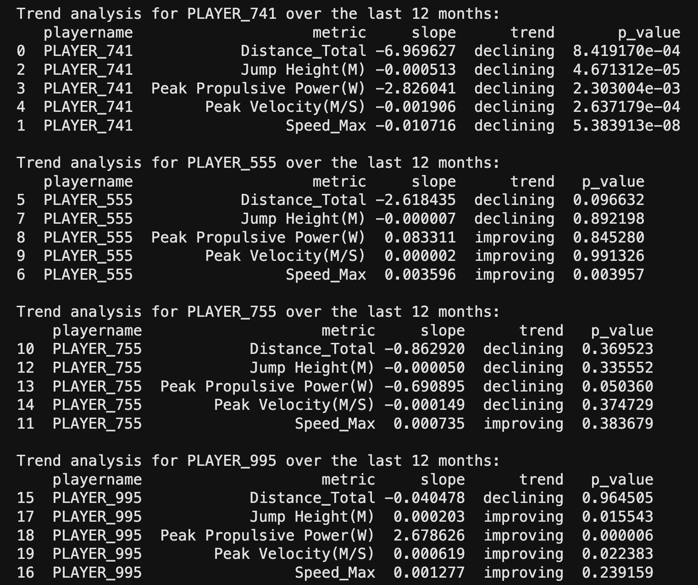

 

---

> Player 995 shows strong, statistically significant gains in key power and velocity metrics over the last 12 months, serving as a model of positive adaptation. Player 555 demonstrates statistically significant improvements in maximum speed, indicating enhanced athletic readiness and explosive capabilities. Player 755 shows significant negative trends in power and velocity, core components of explosive performance, suggest a need for review of this athlete's training load and recovery protocols. Player 741 shows a statistically significant  decline across all metrics, indicating a high risk of overtraining, illness or potential injury.

---

*Refer to `Part3_Player_analysis.pdf` for additional analysis and clinical/performance implications*

 

3.1.4 

**Trends** 

Yes, trends were seen. as expected with inconsistent thresholds and the nature of dynamic human physiologic systems and the attempt to capture their performance with basic metrics without use of a composite index based derived metric.

## Surprises

- Female players not tested as much as the male players (confirms existing knowledge)
- Female players have more speed max values than male players, and their distance total is almost the same as men.
- Knowing that sports performance and metric based performance testing and measurement is very technical and has a lot of dependencies, a lot of literature covers simplistic metric capture without use of composite multi system longitudinal studies. 
- A lot of studies are single device-based; that was a shocker!
- There are not enough construct-based studies to actually understand bodily systems and sports performance (as attempted in this project with RFD and ME&GC). Studies that do construct based studies point to limitations in combining metrics meaningfully.

### 3.2 Team Comparison Analysis

3.2.1 Comparing the 5 selected metric(s) between teams. Code is part of ***`3.2A`** in part3_viz_comparison.ipynb*

Gender stratified aggregate plots

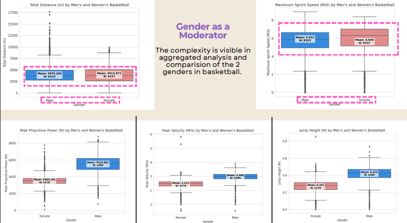

 

**Interpretation:** "Gender as a moderator" visual clearly shows that between both basketball teams, Total Distance is almost the same, and women have a higher speed max. Gender as a moderator plays a role. 
- However, it is also seen that in Speed Max line plot in 3.1.1 above, between April 2025 and July 2025 male players had considerably more Speed Max tests than female players. Could this be the reason that women players have a higher Speed Max?   
- The exact same exact case happens in Total Distance lie plot in 3.1.1 above, where between between April 2025 and July 2025 male players had considerably more Total Distance tests than female players. Could this be the reason that women players almost similar Total Distance results? 
- Were the results in both Total Distance and Speed Max skewed by the more testing frequency of male players in the 4 month period? 

^ Refer to `part3.2_viz_comparison.ipynb` for all visualizations and full analysis

 

3.2.2 Statistical significance. Code is part of ***`3.2B`** in part3_viz_comparison.ipynb*

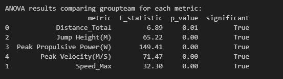

 

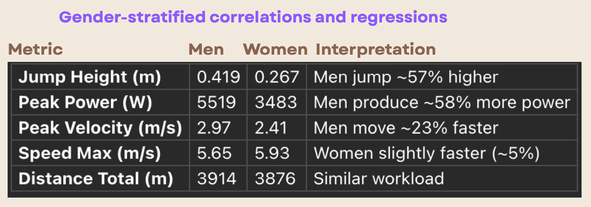

 
---

**Interpretation** 

The F‑statistic compares variance between teams to variance within teams; values far from 1 (here 6.89–149.41) indicate that between‑team differences are much larger than random within‑team noise.​

The associated p‑values (0.01 or 0.00) are < 0.05 alpha level, giving strong evidence that at least one team’s mean differs from the others for each metric, hence the “significant = true” column.​

The ANOVA table above shows that all but Distance Total metric differ significantly between teams, as F statistic is > 1, meaning at least one team’s mean performance is statistically higher or lower than another team’s for every metric tested. 

The metrics are not uniform across both teams, and these differences are unlikely to be due to random variation alone. 

Though Distance Total results are not that different. 

These can be seen in part3.2_viz_comparison.ipynb #3.2 as well.

For power metrics men have more range and higher values. For endurance women have more range and higher values, Smaller F-statistic in these metrics also points to that.

**Could this be because men have had more testing in the 4 month period where women had no testing March to July 2025?**

---

 

3.2.3 Visualization showing testing frequency by team over time: Code is part of ***`3.2C`** in part3_viz_comparison.ipynb*

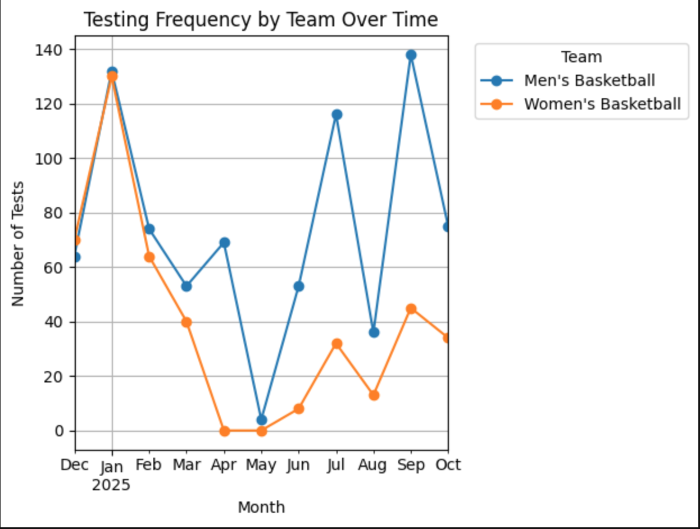

 

**Interpretation:** "Testing Frequency by Team  Over Time" visual clearly shows the gap between male and female testing frequency.

 

3.2.4 In context of your literature review

- Do differences make sense given sport demands?
    - Yes. Results from all metrics align tightly with known physical and technical demands basketball (repeated jumps, agility, greater clustering for speed metrics).

- How do values compare to published norms (if available)?
    - After normalizing outliers, all values are within norms. Observed ranges for the 5 metrics closely match published NCAA and consensus norms.

- What might explain the differences or similarities?
    
    - **Similarities** Values are similar as they are well documented, even when thresholds are inconsistent. Moreover, the 5 metrics are all basic human capability measures based in basic physics and are not composite derived metrics. Humans (especially college level athletes) can perform in sports only within a small range. So values and ranges found in Literature review and in the dataset are comparable and similar (within most-used ranges). Outliers were handled by the script. Except in one case where Jump Height was 7+ meters, most other metrics did not have wild single outliers that stood out.
    
    - **Differences** Sport demands and sex/positional effects are primary drivers. Basketball has tighter clustering due to play structure. Monitoring equity is lacking; women’s basketball shows less robust tracking and reporting, confirming what was found in literature review. Integrated multi-metric frameworks (rather than isolated measures) are increasingly recommended for operationally relevant athlete profiling and better sensitivity. This has been a core insight of this study. These themes reappear in out study.

### 3.3 Dashboard Metric

3.3.1 Total number of tests per month (all systems combined): Code is part of ***`3.3A`** in part3_viz_comparison.ipynb*

 

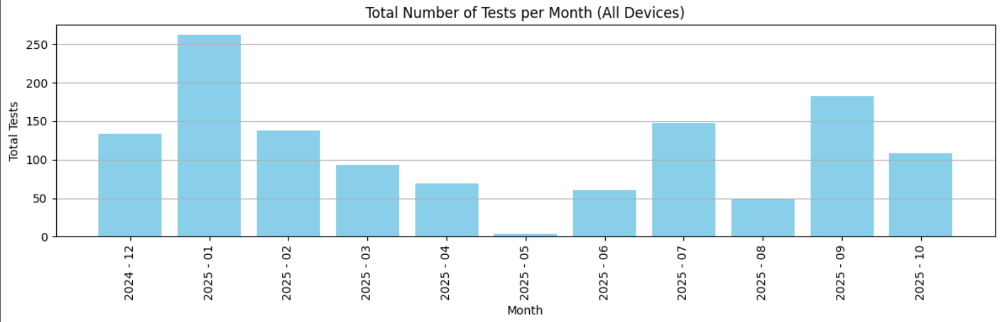

 

3.3.2 Breakdown by data source (stacked bar chart recommended)  Code is part of ***`3.3B`** in part3_viz_comparison.ipynb*

 

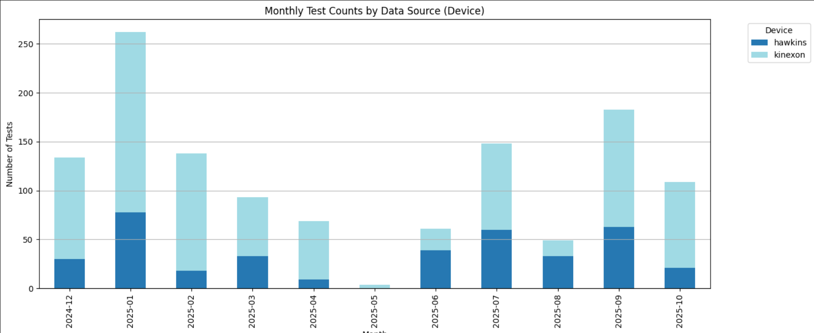

 

3.3.3 Identify any gaps or unusual patterns in data collection

[TOC](#table-of-contents)

---

### Streamlit App

A basic <a href="https://507groupproject2025-gtiyppvvdgrfcijefzwtqz.streamlit.app/">Streamlit App</a>  was created to display the data.

[TOC](#table-of-contents)

---

## 4. Research Synthesis and Application 

## Research and Data Gaps

The following gaps were identified in the literature & data:

- Inconsistent thresholds across studies: Eg: >5% decline in Peak Velocity is not universally applied
- Minimal positional subgroup analysis despite clear sport-specific trends: For Basketball there are no positional data in the dataset, and not much in literature review. Just some sports have positional data in the dataset (eg, Football). 
- As in many other sports, women’s basketball athletes are underrepresented in testing data and literature, reducing generalizability and exposing gaps in coverage
- Lack of unified frameworks that integrate multiple systems (see 4.2.2 below for more on this) this is also the basis of this study

To address these issues, the 5 metrics, consistently represented in both men’s and women’s teams in at least two tracking systems, were selected

[TOC](#table-of-contents)

---

4.1.1 

## Operationalizing Thresholds

### Clinically/performance‑relevant thresholds that can be operationalized in athlete monitoring

**1. Jump Height Decline**

- Threshold: >10–15% decline from baseline.

- Clinical/Performance Relevance: Indicates neuromuscular fatigue even when athletes may not self‑report symptoms. Serves as a practical “red flag” for readiness monitoring.

        
**2. Peak Velocity Asymmetry / Decline**

- Thresholds: 5% decline compared to baseline. 10% limb asymmetry between left/right outputs.
    
- Clinical/Performance Relevance: Sensitive to neuromuscular fatigue and imbalance. 10% asymmetry linked to performance decline and potential injury risk.

**3. Speed Max Relative to Personal Best**

- Threshold: <90% of personal best sprint speed.
    
- Clinical/Performance Relevance: Identifies suboptimal sprint performance, often reflecting fatigue or incomplete recovery. Position‑specific contextualization (e.g., football linemen vs. skill positions, basketball guards vs. forwards).

**4. Distance Total / Workload Ratio**

- Threshold: Acute‑to‑Chronic Workload Ratio (ACWR) increase >20%.
    
- Clinical/Performance Relevance: Strongly associated with elevated injury risk. Useful for flagging overload conditions in both men’s and women’s cohorts.

**5. Peak Propulsive Power (PPP)**

- Threshold: such as declines of 5–10% from baseline PPP indicate moderate fatigue, while >10% reductions signal significant neuromuscular impairment requiring recovery interventions. 
    
- Clinical/Performance Relevance: Identifies values falling below 90% of an athlete’s personal best PPP are commonly used to flag reduced readiness and elevated injury risk. These thresholds make PPP a practical and actionable marker for coaches and practitioners to integrate into daily monitoring frameworks.

**Why These Thresholds Matter**

- Jump Height: Simple, widely used, but limited sensitivity; best interpreted alongside PPP or velocity.
    
- Peak Velocity: Adds nuance by detecting asymmetry and fatigue not captured by jump height alone.
    
- Speed Max: Contextualizes sprint demands by position and ensures athletes are performing near their best.
    
- Distance Total: Provides a workload lens, critical for balancing training load and injury prevention.
    
- Peak Propulsive Power: These thresholds make PPP a practical and actionable marker for coaches and practitioners to integrate into daily monitoring frameworks

 

[TOC](#table-of-contents)

---

4.1.2

## Flag System

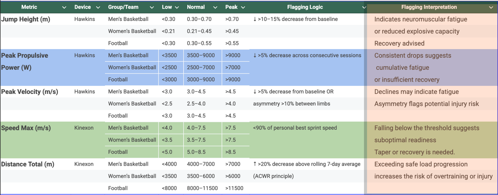

 

The performance monitoring flag system highlights essential changes in athlete performance, training load, and testing consistency. It uses individual baselines, statistical benchmarks, and team norms for a multi-layered approach. Thresholds are based on physiological logic, best practices, and reliable statistics.  
^ For more information refer to `Part4_FlagSystem.pdf`* for explanation about the flag system
​
### Data Cleaning and Validity Thresholds

Before applying any flags, the dataset was cleaned using linear interpolation and carry-forward/backfill methods. Implausible values were removed using gender-specific physiological cut-offs, leaving only realistic data for baselines and risk checks.  
^ For more information refer to `Part4_Justification.pdf`

[TOC](#table-of-contents)

---

## Recommendations

4.2.1 

### Core Relationships and Findings

**Fundamental Relationship** 

- RFD is conceptualized as the athlete's "Engine" (representing explosive strength and lower-limb power output), while ME&GC is the "Drivetrain" (representing explosiveness, quickness, and cumulative movement load). RFD powers an athlete's movement, and ME&GC determines how effectively that power translates into performance.

**Positive Relationship** 

- RFD and ME&GC are positively and consistently related.

**Consistency of Coupling** 

- Coupling between RFD and ME&GC metrics is similar in both sexes.

**Difference in operating Range** 

- Although the coupling is similar, male athletes tend to have an higher operating range in the metrics. Interaction data-models were tested using Gender as a Moderator of the RFD and ME&GC relationships.

**Inconsistent Threshold**

- The literature review identified inconsistent thresholds for most  metrics. Standardized thresholds can be created for various tiers of athletes addressing gender specific variations.

4.2.2 

### Practical Applications and Utility

*   **Composite Index:** A composite index with multiple metrics tied together with constructs (as done in this project) can help create more accurate, meaningful and actionable derived metrics. 

*   **Multi-domain Metrics Clustering:** The empirical data derived from the relationships listed above can help in the creation of metric clustering for comprehensive performance assessment.

*   **Prediction and Improvement:** The established correlations and relationships are crucial because they enable coaches to combine tests of rapid force and movement coordination to better predict and improve performance.

*   **Algorithm Development:** As there are correlations, this can help facilitate the creation of **predictive models and game-readiness algorithms** that can be used for performance forecasting.

*   **Performance Assessment:** The empirical data derived from these relationships can help support **multi-domain metrics clustering** for comprehensive performance assessment across both male and female athletes.

*   **Closing the Gender-gap:** These empirical data driven and derived initiatives can help for comprehensive performance assessment across both male and female athletes.

*   **Implications of Anova test:** As the Anova test (in 3.2.2) above gives strong evidence that at least one team’s mean differs from the others for each metric; “significant" = True”, follow‑up post‑hoc tests are warranted to identify exactly which teams differ on which variables.​ From an applied perspective, staff could use these findings to benchmark teams, target weaker squads for specific interventions (e.g., power or sprint training), and monitor whether future ANOVA tests show convergence or widening of between‑team gaps over time. [^11]

 

[TOC](#table-of-contents)

---

## Part 4 Key Insights

1. There is a relationship between two primary sports performance constructs that form the framework on which this study was designed. These 2 constructs are  
    - Rate of Force Development (RFD) 
    - Movement-Efficiency & Gait-Complexity (ME&GC)  

2. Combined with these constructs and the 5 selected metrics (limited to the sample dataset), it has been demonstrated that there are practical application in creating a composite index of metrics and derived metrics for athlete performance and assessment across sexes. 

3. The project demonstrated key performance based clinical observations.

4. Women's sports metric based testing is a lot less than Men's sprts metric based testing leading to gender-based equity gap. This discovery is supported with the larger sports performance based scholarly work and literature.

[TOC](#table-of-contents)

---

4.2.4 

### Contextual Insight

**1. Female athlete gap**

This project highlighted a significant disparity in current research on female athletes. 
- 70.7% of studies focus solely on male athletes
- 8.8% of studies focus solely on females athletes. 

This gap underscores the critical need to expand female athlete testing and to conduct more studies based on female athletes. Female athletes are underrepresented in many device-based studies. 

When combined, vast **gap in female focused studies** found in the literature, use of different **thresholds** and under-representation of **female testing data**, together point to major gaps in the current collegiate sports performance ecosystem as represented in the visual representation below.

**2. Multi-metric testing** 

Integrating multi-domain metrics can provide a comprehensive approach to athlete monitoring in collegiate sports. This review underscores the practical benefits of combining neuromuscular and movement-based data for fatigue detection, readiness assessment, and injury risk management. 

**3. Future research** 

Expanding normative datasets for collegiate sports athletes and validating cross-platform metrics to enhance precision and applicability can address many research and gender based gaps in sports performance.

**4. Testing**

Metric test-values can be highly sport-, athlete- and protocol-dependent, calling for consistent testing especially to address female testing-gaps. Lack of testing for longitudinal data and gender gaps in testing are compounded by inconsistent metric performance measurement thresholds. In contrast, over-testing can skew results; as happened in 3.2.1 above because many more Total Distance and Speed Max tests for male players in a 4 month period possibly skewed the results such that female players have almost same distance toal values and better speed max values.

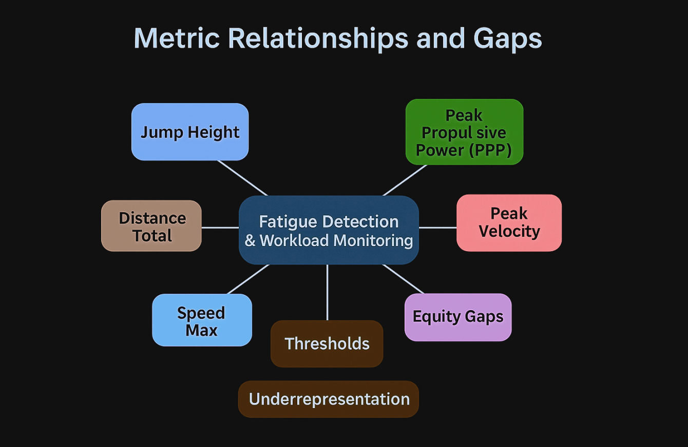

 

[TOC](#table-of-contents)

---

## Closing Remarks

Many more questions came-up while wrapping up this project. Here are some that stood-out:
- Did the project find a causal relationship between RFD and ME&GC? 
- Is less female testing solely responsible for lesser number of studies on female athletes?
- What role do funding, sponsorships, merch-sales, and other aspects play in one sport getting more attention than others? What explains Football athletes having the most tests, followed by Basketball athletes? Is it purely because these 2 sports are more popular and quintessentially "American" and so more preferred?
- What is the role of technicians and staff who actually operate/monitor these devices?
- Are there SOP's around these tests, and are such SOP's being followed? 
- Is the ease of using Kinexion devices vs Hawkins devices (re 1.4.1 above) lead to more Kinexion based testing? How does this explain the far less number of female player testing?
- NCAA tier-one sports campuses have a lot of money at stake, federal grants, sponsorships, etc. They also benefit from employing students in the athletic departments. Do these factors influence the quality of testing and data gathering?
- Athletic data can take a lot of compute and technology resources to get any meaningful insights from the data. Does the IT infrastructure and a an athletic departments IT budget determine how the quality of sports data and how it can be used?

 

[TOC](#table-of-contents)

---

## Limitations

The following limitations can be seen in sports performance measurement and sports data projects.

- Missing or irregular testing reduces baseline stability.
- Gaps in gender testing biases or practices can skew data results. This dataset does not show male and female teams for many sports; that reduces gender based data analysis. Most women teams in this dataset has far less >5 measurements then men. That skews results, and can impact performance, as composite metrics are more meaningful. An argument could be that this is because there are more male vs female players. But when percentages are less for women than men, that clearly shows women players are not tested the same. This is clear in bar plot in Section 2.1.2 above.
- Gender inference from team labels may lead to classification errors. Inferring gender from team labels can sometimes lead to people being assigned to the wrong gender category. This happens because team names or labels are an imperfect way to determine individuals’ genders and can introduce classification errors.
- Team-level z-scores may mask individual variability. Team-level z-scores aggregate individual performances into a single group metric, which can hide differences in performance among team members.
- Sensor noise and interpolation may influence ME&GC metrics. Imputation and interpolation rely on surrounding data points, the resulting values are assumptions rather than true observations. If the neighboring values are unusually low or high, the imputed value will inherit that bias. Moreover, these methods can also create artificial trend lines, reduce natural variability, and potentially mask the true cause of changes in the data. Additionally, imputation often pulls values toward the median, introducing bias and altering the distribution of the dataset.
- Contextual factors like injury, fatigue, practice type, etc. are often not measured and accounted for in sports testing.
- More data also tends to create higher averages.

^Refer to `Part5_Observations_Limitations.pdf` for additional information

[TOC](#table-of-contents)

---

## Was the research question answered?

**Were the most important metrics for Rate of Force Development (RFD) and Movement-Efficiency & Gait-Complexity (ME&GC) found?**

While there is no certain answer, the research question most certainly steered the project in the right direction. It was established that the best approach is to use composite derived metrics that are based on sports constructs and employ multiple metrics. This is the best way to measure athlete performance and sports training from a systems perspective. For instance, how does force driven metrics interact with movement driven metrics, and how these two impact gait and the complex human movement spectrum. Or how such dynamics impact positional training, performance, recovery, risk assessment and remediation.

**Is it known how female and male athletes perform in these metrics?**

Pretty much. Metric testing and tracking are sports- and protocol-driven. The study certainly established that female athletes are much less tested, have more testing gaps, and more inconsistently tested than male athletes. This question further helped in learning about the gender gap in collegiate sports performance testing.

Moreover, the research question helped identify important gaps by analyzing a sample college-level sports testing and performance dataset at a NCAA Tier-1 university, and comparing it to the larger literature, and offers some practical recommendations.

 

[TOC](#table-of-contents)

## Resources

Tools

 

Project management
- Github Project
- Excel dashboards

Collaboration & communication
- Microsoft Teams / Zoom 
- Google Drive

IDE's for coding and statistical analysis
- VS Code
- Google Colab

 

Team Members

 

   

Siddikha Abrahim

 

Role: Research Assistant

Contributions: 
- Initial deliverables mapping
- Checked some parts for code reproducibility
- Initial literature review
- Ranges and thresholds research
- Documentation templates
- Initial pair work on 2 women athletes
- Assisted in quality check

 

Naira Khergiani

 

Role: Research Analyst

Contributions: 
- Literature review & analysis 
- Checked some parts for code reproducibility
- Ranges and thresholds research and analysis
- Pair work on women athletes and teams  
- Documentation
- Analysis and Insights

 

Jaison Philip

 

Role: Research Analyst

Contributions: 

- Initial deliverables mapping
- Checked some parts for code reproducibility
- Initial literature review
- Worked on all four selected players and teams 
- Real-world applicability with clinical relevance
- Documentation
- Analysis and Insights

 

Paul Quimbo

 

Role: Lead Coder

Contributions: 
- Code planning 
- Checked for code reproducibility
- Led all iterations of code development 
- Data quality assessment 
- Analysis and Insights
- Code-related documentation
- Streamlit app (End-to-End planning and coding)
- Managed Github repo
- Code audit and quality check
- Final Github documentation

 

Briggs Prashar

 

Role: Project Lead

Contributions: 
- End-to-end project planning, management and execution
- Created project logic and framework
- Created and managed workflows for the whole project
- Led and facilitated all meetings, collaboration, communication and interactions 
- Ran a parallel alt-code to double check the output and validate results
- Checked for reproducibility of the main code
- Responsible for all deliverables 
- Final literature review and research question 
- Analysis and Insights
- Streamlit app (Feedback)
- Documentation and quality check and audit 
- Double checked and corrected all submitted documentation and references
- Code documentation and audit (with Paul)
- Created the final versions of the presentation and all final documentation for the project
- Final GitHub documentation. (with Paul)

 

[TOC](#table-of-contents)

---

## References

[^1]: Philipp NM, Cabarkapa D, Nijem RM, Blackburn SD, Fry AC. Vertical Jump Neuromuscular Performance Characteristics Determining On-Court Contribution in Male and Female NCAA Division 1 Basketball Players. Sports (Basel). 2023;11(12):239. Published 2023 Dec 4. doi:10.3390/sports11120239

[^2]: Hicks J, McLaren SJ, Malone JJ, et al. Investigating the stretch-shortening cycle fatigue response to a high-intensity stressful phase of training in collegiate men's basketball. Front Sports Act Living. 2024;6:1377528. doi:10.3389/fspor.2024.1377528

[^3]: Wang X, Lv C, Qin X, Ji S, Dong D. Effectiveness of plyometric training vs. complex training on the explosive power of lower limbs: A Systematic review. Front Physiol. 2023;13:1061110. Published 2023 Jan 18. doi:10.3389/fphys.2022.1061110

[^4]: Sanders GJ, Skodinski S, Peacock CA. Impact of Early Season Jump Loads on Neuromuscular Performance in Division I Volleyball: Analyzing Force, Velocity, and Power From Countermovement Jump Tests. Transl 

[^5]: Chapman M, Tomkins SD, Triplett TN, Larumbe-Zabala E, Naclerio F. Estimation of peak vertical velocity and relative load changes by subjective measures in weightlifting movements. Biol Sport. 2022;39(3):639-646. doi:10.5114/biolsport.2022.106156

[^6]: Szabó N, Atlasz T, Váczi M, Sebesi B. Does the 10% Asymmetry Threshold Matter? Effects of Lower-Limb Asymmetries on Jumping and Agility in Basketball. J Funct Morphol Kinesiol. 2025;10(4):445. Published 2025 Nov 18. doi:10.3390/jfmk10040445

[^7]: Gualtieri A, Rampinini E, Dello Iacono A, Beato M. High-speed running and sprinting in professional adult soccer: current thresholds definition, match demands and training strategies. A systematic review. Front Sports Act Living. 2023;5:1116293. doi:10.3389/fspor.2023.1116293

[^8]: Ruiz-Álvarez A, Leicht AS, Vaquera A, Gómez-Ruano MÁ. Effect of Speed Threshold Approaches for Evaluation of External Load in Male Basketball Players. Sensors (Basel). 2025;25(19):6085. Published 2025 Oct 2. doi:10.3390/s25196085

[^9]: Gholizadeh R, Nobari H, Bolboli L, Siahkouhian M, Brito JP. Comparison of Measurements of External Load between Professional Soccer Players. Healthcare (Basel). 2022;10(6):1116. Published 2022 Jun 15. doi:10.3390/healthcare10061116

[^10]: Qin W, Li R, Chen L. Acute to chronic workload ratio (ACWR) for predicting sports injury risk: a systematic review and meta-analysis. BMC Sports Sci Med Rehabil. 2025;17(1):285. Published 2025 Sep 30. doi:10.1186/s13102-025-01332-x

[^11]: Girginer FG, Seyhan S, Açar G, Bilici MF, Bilici ÖF, Soylu Ç. Acute effects of the RAMP warm-up on sprint and jump performance in youth soccer players. Front Physiol. 2025;16:1612611. Published 2025 Jun 24. doi:10.3389/fphys.2025.1612611

 
