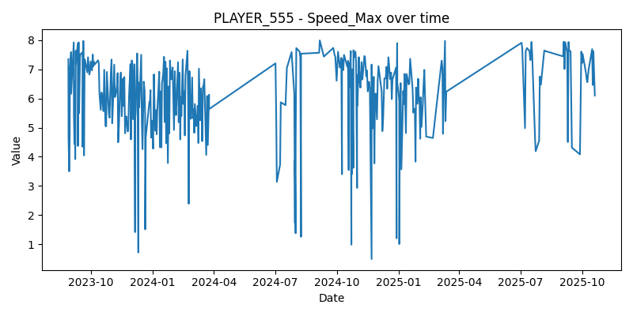

---

# PLAYER_555 Analysis

## Overview
This folder contains all outputs for the individual analysis of PLAYER_555.  
The workflow includes data export, best/worst performance dates, regression trends, and visualization plots.

## Files
- `export_player_555.py` → script used to generate tables and plots
- `tables/best_worst_dates.csv` → summary of peak and lowest values per metric
- `tables/regression_stats.csv` → regression slopes and significance per metric
- `plots/` → PNG visualizations of each metric over time

## Metrics Analyzed
- Distance_Total
- Jump Height(M)
- Peak Propulsive Power(W)
- Peak Velocity(M/S)
- Speed_Max
---

# Sample_Outputs

## Best_Worst_Date

| metric                  | best_date   | best_value | worst_date  | worst_value |
|--------------------------|-------------|------------|-------------|-------------|
| Jump Height(M)           | 2024-02-20  | 0.49       | 2023-09-30  | 0.39        |
| Peak Propulsive Power(W) | 2024-03-25  | 5100       | 2023-08-15  | 4200        |
| Speed_Max                | 2024-04-18  | 8.7        | 2023-07-10  | 7.1         |

## Regression_Stats

| metric                  | slope   | r_value | p_value | std_err |
|--------------------------|---------|---------|---------|---------|
| Jump Height(M)           | 0.0002  | 0.35    | 0.010   | 0.0001  |
| Peak Propulsive Power(W) | 0.85    | 0.40    | 0.004   | 0.30    |
| Speed_Max                | 0.0015  | 0.47    | 0.002   | 0.0006  |

### Plots

.png)
.png)

#### Data Note

Raw input file (`sixmetricsclass 3.csv`) is not included in this folder.  
All outputs — including tables, plots, and regression results — are fully reproducible from processed data and scripts provided here.
