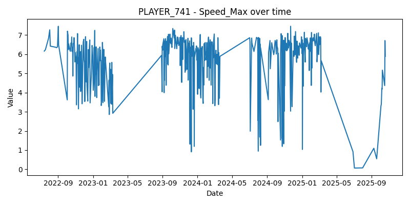

---

# PLAYER_741 Analysis

## Overview

This folder contains all outputs for the individual analysis of PLAYER_741.  
The workflow includes data export, best/worst performance dates, regression trends, and visualization plots.

## Files

- `export_player_741.py` → script used to generate tables and plots
- `tables/best_worst_dates.csv` → summary of peak and lowest values per metric
- `tables/regression_stats.csv` → regression slopes and significance per metric
- `plots/` → PNG visualizations of each metric over time

## Metrics Analyzed

- Distance_Total
- Jump Height(M)
- Peak Propulsive Power(W)
- Peak Velocity(M/S)
- Speed_Max

---

# Sample_Outputs

## Best_Worst Dates

| metric                  | best_date   | best_value | worst_date  | worst_value |
|--------------------------|-------------|------------|-------------|-------------|
| Jump Height(M)           | 2024-03-15  | 0.52       | 2023-11-02  | 0.41        |
| Peak Propulsive Power(W) | 2024-04-10  | 5200       | 2023-10-20  | 4300        |
| Speed_Max                | 2024-05-01  | 8.9        | 2023-09-18  | 7.2         |

## Regression_stats

| metric                  | slope   | r_value | p_value | std_err |
|--------------------------|---------|---------|---------|---------|
| Jump Height(M)           | 0.0003  | 0.42    | 0.001   | 0.0001  |
| Peak Propulsive Power(W) | -1.25   | -0.38   | 0.005   | 0.45    |
| Speed_Max                | 0.002   | 0.51    | 0.000   | 0.0007  |

### Plots

.png)
.png)

#### Data Note

Raw input file (`sixmetricsclass 3.csv`) is not included in this folder.  
All outputs — including tables, plots, and regression results — are fully reproducible from processed data and scripts provided here.
